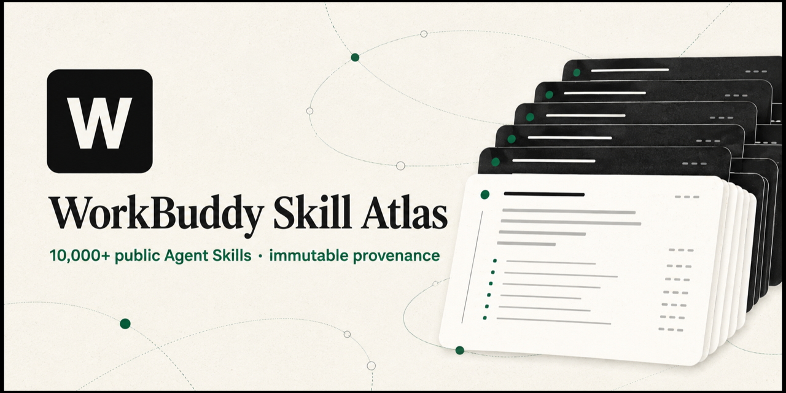

# WorkBuddy Skill Hub



一个面向 WorkBuddy 的开放 Skill 目录与精选工作流集合。你可以发现公开
Skills，查看来源与许可证，选择适合的能力，并下载经过整理的 WorkBuddy
版本。

[](https://github.com/sandbaseai/workbuddy-skill/releases/latest)
[](LICENSE)
[](https://github.com/sandbaseai/workbuddy-skill/stargazers)

[中文](#中文) · [English](#english) · [Skill Atlas](https://sandbaseai.github.io/workbuddy-skill/)

## 中文

### 三步开始

1. 在 [Skill Atlas](https://sandbaseai.github.io/workbuddy-skill/) 或[中文目录](https://sandbaseai.github.io/workbuddy-skill/zh-CN.html)中搜索需求。
2. 打开条目的来源链接，阅读说明、许可证、权限和外部依赖。
3. 从 [Releases](https://github.com/sandbaseai/workbuddy-skill/releases/latest) 下载所需 ZIP，在 WorkBuddy 的 **专家 · Skills · Connectors → Skills → 添加 Skill** 中上传。

精选成品也可以按精确路径安装：

```bash
gh skill install sandbaseai/workbuddy-skill skills/oss-review --dir .workbuddy/skills
```

### 可以解决什么问题

- 找到适合研究、开发、测试、设计、数据、文档和运营的 Agent 能力
- 在执行前了解来源、许可证、权限、输入输出和潜在风险
- 用经过 WorkBuddy 适配的工作流完成代码评审、故障排查、发布、研究和内容处理
- 对不支持的工具、缺失权限或不确定结果明确说明，不把猜测当成执行结果

### 示例

```text
找一个适合中文发票 OCR 的 API，只比较候选、参数和价格，不要执行付费调用。
```

```text
审查这次代码变更的回归风险，并给出每个结论对应的证据。
```

```text
设计一次只在测试环境执行的韧性实验，先写假设、基线、影响范围和回滚方案。
```

### 精选 WorkBuddy Skills

| Skill | 适合场景 |
|---|---|
| [SandBase](skills/sandbase/) | 发现、比较并调用实时 API 和模型 |
| [Code Reviewer](skills/code-reviewer/) | 评审正确性、回归、维护性、安全和发布风险 |
| [Documentation](skills/documentation/) | 编写有证据、可执行、易维护的项目文档 |
| [Network Troubleshooting](skills/network-troubleshooting/) | 分层定位 DNS、路由、TLS、HTTP 和资源问题 |
| [Chaos Engineer](skills/chaos-engineer/) | 设计有授权、可回滚、影响范围受控的韧性实验 |
| [Cloud Cost Optimization](skills/cloud-cost-optimization/) | 按实际成本驱动因素排序，验证取舍，建模节省并治理授权变更 |
| [Cloud Architect](skills/cloud-architect/) | 设计跨云架构、迁移波次、灾备、成本与安全取舍 |
| [Database Query Optimizer](skills/database-query-optimizer/) | 从执行计划和性能基线定位慢 SQL，并验证单变量优化 |
| [Microservices Architect](skills/microservices-architect/) | 设计服务边界、通信、数据所有权、故障隔离和迁移验证 |
| [Cloud Design Patterns](skills/cloud-design-patterns/) | 按约束选择韧性、性能、消息、安全、部署和迁移模式 |
| [Technical Spike](skills/technical-spike/) | 用时间盒和最小实验解决实现前的关键技术未知数 |
| [Cloud Resource Health](skills/cloud-resource-health/) | 从资源状态、指标、日志、依赖和变更记录诊断云资源健康问题 |
| [Code Tour](skills/code-tour/) | 为上手、评审、排障和架构理解生成经过真实锚点校验的代码导览 |
| [Agentic Evaluation](skills/agentic-evaluation/) | 用明确量规、证据和有界迭代评测并改进 Agent 输出 |
| [GitHub Actions Hardening](skills/github-actions-hardening/) | 审查工作流触发器、注入、权限、供应链、Secrets 和 Runner 风险 |
| [GitHub Actions Efficiency](skills/github-actions-efficiency/) | 用运行数据优化 CI 时间、成本、缓存、并发、路径和矩阵，同时保留必要门禁 |
| [AWS Resource Query](skills/aws-resource-query/) | 将自然语言转换为带账号、区域、分页和脱敏边界的 AWS 只读查询 |
| [Azure Deployment Preflight](skills/azure-deployment-preflight/) | 在 Azure 部署前校验 Bicep、参数、权限和 what-if 变更风险 |
| [AWS Well-Architected Review](skills/aws-well-architected-review/) | 按 AWS 六大支柱结合 IaC 与线上证据审查架构和风险 |
| [Incident Post-Mortem](skills/incident-postmortem/) | 以证据重建时间线、量化影响、无责分析根因并跟进行动项 |
| [Dependabot Management](skills/dependabot/) | 治理多生态依赖更新、安全更新、分组策略、调度和告警分流 |
| [Agent Governance](skills/agent-governance/) | 以策略、审批、限额、信任和审计约束 Agent 工具与委派行为 |
| [Incident Response and Triage](skills/incident-triage/) | 处理事件、稳定服务、验证恢复并沉淀经验 |
| [Security Audit](skills/security-audit/) | 审查信任边界、控制措施、漏洞和残余风险 |
| [RAG Evaluation](skills/rag-evaluation/) | 评估检索、引用、事实依据、拒答、成本和回归 |
| [Playwright Web App QA](skills/playwright-webapp-qa/) | 验证浏览器流程、可见状态和网络/控制台问题 |
| [Deep Evidence Research](skills/deep-research/) | 产出带来源、争议和限制说明的研究结果 |

浏览 [完整精选目录](skills/) 或直接打开 [Skill Atlas](https://sandbaseai.github.io/workbuddy-skill/)。每个精选条目都提供来源说明；外部来源的许可证和适配信息见对应的 `SOURCE.json`。

### 目录与来源

目录收录公开 GitHub `SKILL.md` 条目，并提供来源路径、内容指纹、许可证/来源信息和兼容性提示。目录条目不是安装批准：安装前请自行阅读原始内容，尤其注意脚本、网络访问、凭据和副作用。

<!-- CATALOG-METRICS:START -->
| Metric | Current snapshot |
|---|---:|
| Indexed GitHub paths | 12,661 |
| Unique content SHAs | 8,034 |
| Source repositories | 6,431 |
<!-- CATALOG-METRICS:END -->

静态检查只能帮助筛选，不能替代人工安全审查。目录的字段说明和来源约定见[目录文档](catalog/README.md)；适配指南见[中文文档](docs/adapting-skills.zh-CN.md)和[English guide](docs/adapting-skills.md)。

<!-- CATALOG-ANALYSIS:START -->
The catalog is reviewed for structural compatibility and conservative security signals; inspect each source before installation.
<!-- CATALOG-ANALYSIS:END -->

需要更多 WorkBuddy 文档、MCP、工作流、评测与 Skills，可浏览 [Awesome WorkBuddy](https://github.com/sandbaseai/awesome-workbuddy)。

## English

WorkBuddy Skill Hub is an open catalog of public Agent Skills plus a curated set of reviewed, bilingual WorkBuddy workflows.

1. Search the [Skill Atlas](https://sandbaseai.github.io/workbuddy-skill/).
2. Read the immutable source, license, permissions, dependencies, and side effects.
3. Download a ZIP from [Releases](https://github.com/sandbaseai/workbuddy-skill/releases/latest) and add it in WorkBuddy under **Experts · Skills · Connectors → Skills → Add Skill**.

The catalog is for discovery, not automatic approval. Review every external Skill before use, and pin a release or commit when reproducibility matters. See the [English adaptation guide](docs/adapting-skills.md) for preparing a reviewed workflow.

## Compatibility

| Environment | Support |
|---|---|
| WorkBuddy | Primary package format |
| Other Agent Skills-compatible hosts | Instructions are generally portable; metadata or tools may need adaptation |
| Chat-only assistants | Guidance only; they cannot execute WorkBuddy connectors |

## Contributing

Issues and pull requests are welcome. To nominate a public Skill, include its exact source, license, permissions, and the user problem it solves. Please never commit API keys, access tokens, private prompts, or customer data.

For help, see [SUPPORT.md](SUPPORT.md); for vulnerability reports, see [SECURITY.md](SECURITY.md). Release history is in the [changelog](CHANGELOG.md).

## License

[MIT](LICENSE)
