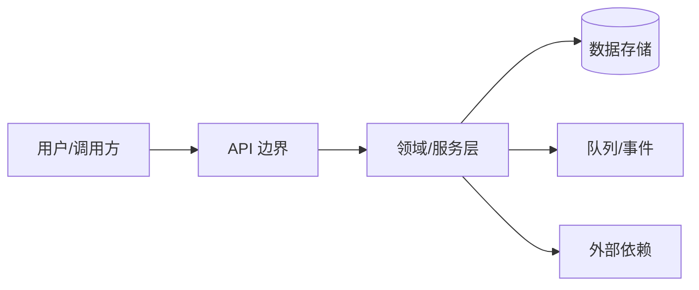

# 项目架构蓝图生成器

从真实代码、配置、依赖、测试、部署和历史证据生成可维护的架构蓝图。目标是帮助新成员理解系统、帮助评审保持边界、帮助变更识别影响；蓝图必须描述实现事实，不把理想设计、目录名称或自动推断伪装成现状。

## 范围与安全边界

- 开始前锁定仓库、commit/tag、子目录、技术栈、环境、读者、详情级别、图表类型、是否包含代码示例/ADR、owner 和授权范围。
- 默认只读扫描源码、配置、依赖锁文件、测试、IaC、部署文件和公开历史；不得启动服务、连接数据库、访问云资源、调用外部 API、执行不可信构建或修改文件。
- 排除 `.env`、密钥、token、个人数据、完整日志、生产 URL、私有配置和不相关 vendor；图表、代码片段和报告都要脱敏、最小化并限制访问。
- 每条结论标为 `observed`、`derived`、`inferred` 或 `unknown`，附文件/行号、版本和验证方式；“没有搜索到”不是“没有实现”。
- 自动生成的图、摘要和评分是辅助材料，不是安全、合规、性能或灾备认证；架构修复、迁移、权限和发布动作必须另行授权。

## 分析流程

### 1. 建立证据基线

记录目录快照、语言/框架、构建与包管理器、直接/传递依赖、入口、环境变量名、服务/队列/数据库/外部系统、测试命令、部署拓扑和生成文件。以锁定 commit 为准，标出生成代码、重复模块、未追踪文件和扫描盲区；不要仅根据文件夹名判断边界。

### 2. 识别边界与依赖

绘制组件、层、模块、服务、数据存储、用户/外部系统和信任边界。追踪 import/package、HTTP/RPC、事件、队列、文件、数据库、缓存和配置引用，标明同步/异步、方向、协议、重试/超时、身份、数据分类和 owner。检查循环依赖、越层访问、共享数据库、隐式全局状态、跨租户路径和单点故障，但把推断与直接依赖证据分开。

示例只是图表骨架；实际蓝图必须从代码和配置生成节点/边，并标注未知、环境差异和证据链接，不能绘制理论架构冒充现状。

### 3. 文档化组件与数据

对每个组件写明职责、输入/输出、公开接口、依赖、边界、关键抽象、生命周期、配置、错误/重试、观测、测试和可扩展点。描述领域模型、实体关系、数据转换、读写模式、缓存、保留/删除、迁移、备份和敏感字段；不要复制真实数据或凭据。

### 4. 记录横切控制

从实现证据说明认证/授权、租户隔离、输入校验、错误处理、超时/熔断、日志/指标/追踪、配置/密钥、限流和审计如何落地。检查控制发生在哪一层、默认值、失败语义、覆盖路径和测试；缺少运行时证据时写 `unknown`，不因存在 middleware 名称就判定全覆盖。

### 5. 记录测试、部署与演进

映射 unit/integration/system/contract 测试到组件和边界，注明 fixture、mock、数据策略和未覆盖项。依据 IaC、容器、CI/CD、环境配置和 manifest 描述部署拓扑、配置注入、身份、网络、扩缩容、健康、回滚和环境差异；不要从一个开发文件推断生产状态。

分析近期变更、ADR、deprecation、迁移和 TODO，提出保持边界的新增功能、外部集成、版本兼容、适配器、反腐层和回滚模式。建议必须引用现状证据和约束，标注替代方案、代价、风险和需要 owner 决定的事项。

## 架构蓝图输出

建议生成 `Project_Architecture_Blueprint.md`，包含：

1. 范围、commit、读者、假设、术语和证据方法；
2. 一页架构摘要与真实边界图；
3. 组件/层/依赖矩阵、关键数据流和信任边界；
4. 数据架构、接口/事件、错误和观测；
5. 认证授权、配置密钥、韧性和审计控制；
6. 测试架构、部署拓扑、环境差异和恢复路径；
7. 已观察的架构模式、违规/循环、风险和未知项；
8. 扩展指南、决策记录、替代方案、技术债和复查触发器。

代码示例只截取最小、脱敏、可定位片段，并注明文件/行号、版本和是否代表性；引用受版权或许可证约束的代码时遵守项目政策。图表应可渲染、可访问、有图例和方向，不能用视觉复杂度掩盖缺失证据。

## 验证与维护

完成后执行链接/Markdown/图表渲染检查，核对组件和边是否能回溯到源码/配置，抽样运行安全的只读分析或测试命令，并把工具版本、时间和失败记录下来。让组件 owner 复核职责、数据流、权限和部署结论；对无法复核的内容保持 `unknown`。

设定更新触发器：公共接口/事件、依赖或框架升级、数据存储/迁移、部署拓扑、权限/网络、重大事故、性能基线或组件 owner 变化。旧蓝图标注适用 commit 和 deprecated 状态，保留差异与理由，不静默覆盖人工决策记录。

## 质量门禁

- [ ] 仓库/commit、目录范围、读者、详情、图表选项、假设和授权已记录。
- [ ] 技术栈、组件/层、依赖、数据流、信任边界、接口和环境差异均有实现证据。
- [ ] 认证、授权、配置、密钥、韧性、观测、测试、部署、恢复和数据生命周期已覆盖或标记未知。
- [ ] 图表与代码片段真实、可渲染、可访问、可定位且已脱敏，不包含凭据或生产数据。
- [ ] 循环/越层/单点/技术债和建议区分事实、推断、风险与方案，并有 owner/复查路径。
- [ ] 蓝图通过链接/Markdown/渲染检查，版本化保存，变更触发器、评审人和发布授权已定义。

## Related Skills

- `acquire-codebase-knowledge` - 建立源码、配置和历史证据地图
- `architectural-decision-record` - 记录有证据的架构决策与后果
- `documentation-writer` - 按文档目的组织可维护内容
